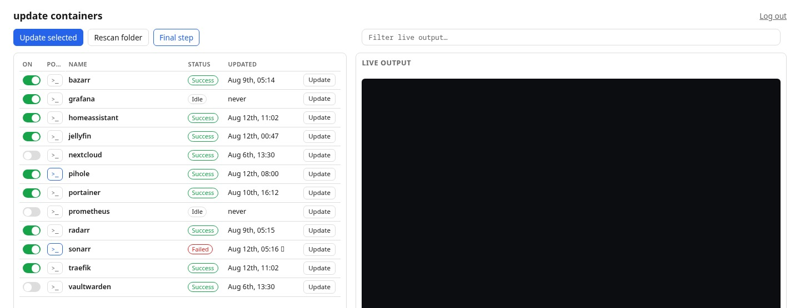

# compose-updater

[](LICENSE)
[](https://github.com/deputynl/compose-updater/pkgs/container/compose-updater)

A tiny, self-hosted web UI for batch-updating Docker Compose stacks that
live in per-container subfolders under one parent directory. Toggle
which containers are included in a group update, pull everything
selected in parallel, or update a single container on demand — with
live output streamed to the browser.

No database, no build step, no JS framework: a single Go binary, a
JSON state file, and server-rendered HTML with a sprinkle of
[htmx](https://htmx.org).



## How it works

- Point it at a parent folder where every immediate subfolder has its
  own `docker-compose.yml` (or `compose.yaml`, etc.) — that's your
  "stack" list.
- Give it the Docker socket. It shells out to `docker compose pull`
  then `docker compose up -d --remove-orphans` in each stack's folder,
  requesting `COMPOSE_PROGRESS=json` so it can show a real byte-level
  progress bar while pulling and a container-by-container status while
  starting, instead of just a wall of log text. Compose plugins too old
  to know that env var just ignore it, and the UI falls back to showing
  their plain-text output with no progress bar — everything else still
  works.
- Toggle state (which stacks are included in "Update selected") and
  the admin password hash are the only things persisted, in
  `/data/state.json` and `/data/auth.json`.

## Running it

```bash
cp docker-compose.example.yml docker-compose.yml
# edit docker-compose.yml: point the bind mount at your real containers folder
docker compose up -d
```

This pulls the prebuilt `ghcr.io/deputynl/compose-updater:latest` image,
built for both `linux/amd64` and `linux/arm64` so Docker fetches the
right variant automatically. Pinned tags like
`ghcr.io/deputynl/compose-updater:20260812083118` are also published for
each release, see
[Packages](https://github.com/deputynl/compose-updater/pkgs/container/compose-updater).

Or build from source instead — swap `image: ghcr.io/deputynl/compose-updater:latest`
for `build: .` in `docker-compose.yml` and run `docker compose up -d --build`.

Then open `http://<host>:8080`. On first visit you'll be asked to set
the admin password (user is always `admin`). After that, log in and
you'll see the stack table.

### The one gotcha: mount path must match the host

compose-updater runs `docker compose` *inside its own container*, but
that command talks to the *host's* Docker daemon through the mounted
socket. Any relative bind-mount in your compose files (`./data:/data`)
gets resolved to an absolute path by the `docker compose` CLI process,
and that path has to be valid on the host for the daemon to use it
correctly. So: mount your parent containers folder at the **exact same
absolute path** inside compose-updater's container as it has on the
host (see the comment in `docker-compose.example.yml`).

## Configuration (environment variables)

| Variable       | Default     | Meaning                                             |
|----------------|-------------|------------------------------------------------------|
| `COMPOSE_ROOT` | `/compose`  | Parent folder containing one subfolder per stack     |
| `DATA_DIR`     | `/data`     | Where `state.json` / `auth.json` are stored          |
| `LISTEN_ADDR`  | `:8080`     | HTTP listen address                                  |
| `MAX_PARALLEL` | `4`         | Max stacks updated concurrently in one run           |

## Auth

Single user, `admin`, password set on first run and stored as a bcrypt
hash — nothing else. There's no password-recovery flow: to reset it,
stop the container, delete `password_hash` from `/data/auth.json`
(or delete the whole file), and restart; you'll be dropped back into
setup.

Sessions are kept in memory, so restarting the container logs
everyone out.

## Post-update steps

Each stack can have an optional shell script attached (the `>_` button
on its row) that runs once `docker compose up -d` has succeeded -
useful for things like running a migration or clearing a cache inside
the freshly-started container. It runs via `docker compose exec -T
<container> sh -c` in the stack's own folder, with output streamed into
the same log console; if it exits non-zero the whole run is marked
failed, even though the pull/up themselves succeeded. The button turns
accent-colored when a stack has a script configured, and hovering it
shows the script.

The container/service name can be left blank if the stack has exactly
one service - it's auto-detected via `docker compose config --services`.
Stacks with more than one service need it set explicitly, or the run
fails with a clear error naming the available services.

## Final step

The "Final step" toolbar button configures a *global* shell script that
runs once after every stack in "Update selected" has finished (not
after single-container updates), independent of any individual stack's
outcome — e.g. reclaiming space with `docker image prune -a -f`, which
is the default, on by default. Its output streams into the console
tagged `(cleanup)`. Disabling it, or blanking the script, sticks -
it won't silently re-enable itself on restart.

The dialog also has a "Run now" button that runs whatever's currently
in the script box immediately, independent of any "Update selected"
run and regardless of the enabled toggle or whether you've hit Save -
handy for testing an edit before committing to it. It's blocked while
another run (group update or another manual run) is already in progress.

The "Updated" column only bumps when a stack actually changed something
(compose reported a real recreate/start, not just "already running") -
a no-op update leaves the timestamp at whenever the last real change
was, so it doesn't look like it just updated when there was nothing new
to pull.

The live output panel has a filter box above it — type a stack name (or
any substring, e.g. a partial name or `cleanup` for the final step) to
show only that stack's lines. It re-slices what's already streamed in
during the current page load rather than making another request, so
switching the filter is instant and doesn't lose earlier output.

## Security notes

- Mounting `/var/run/docker.sock` gives this container root-equivalent
  control over your host's Docker daemon. Anyone who can reach the web
  UI and knows (or guesses/brute-forces) the password can run
  arbitrary containers on your host. There's no login rate-limiting —
  keep this on a trusted LAN, don't expose it to the internet.
- If you do need remote access, put a reverse proxy with TLS in front
  rather than exposing port 8080 directly.
- Post-update scripts run inside the target stack's own container (via
  `docker compose exec`), not on the compose-updater host - but since
  compose-updater already has root-equivalent control over the Docker
  daemon via the mounted socket, this doesn't add a new privilege
  boundary either way. Still worth knowing before pasting in a script
  from somewhere you don't trust.

## Local development (without Docker)

```bash
go build -o compose-updater .
mkdir -p /tmp/compose-root/example-stack /tmp/data
cat > /tmp/compose-root/example-stack/compose.yaml <<'EOF'
services:
  hello:
    image: alpine
    command: ["sleep", "infinity"]
EOF

COMPOSE_ROOT=/tmp/compose-root DATA_DIR=/tmp/data ./compose-updater
```

Requires `docker` and the `compose` plugin on your PATH for the actual
pull/up steps to work when run outside the container image.
